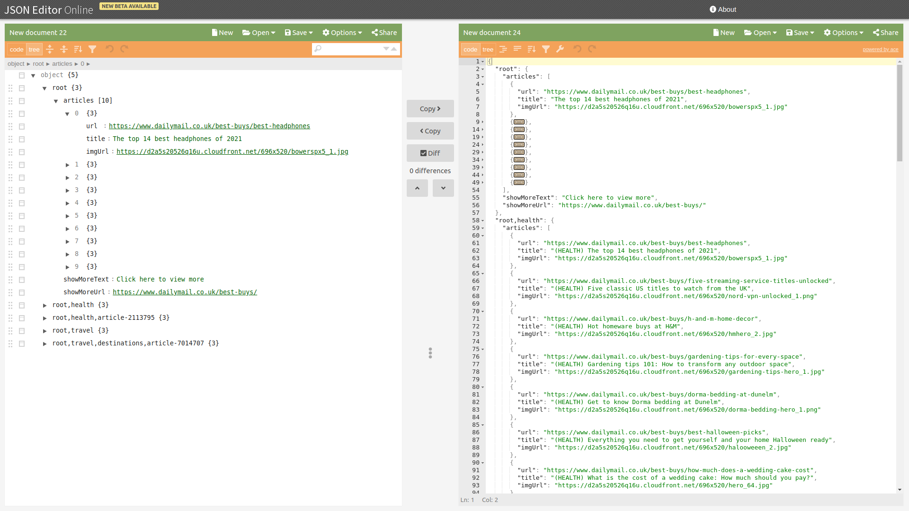

# The Article Feeds API.
## Overview
This document describes the integration API that can be used for Article Feeds.
The Article Feeds API serves HTTP requests, as described below.
## Scope
The scope of the following documentation is limited to the integration done by MailOnline of the GSG Article Feeds API.
Increments of this document will be made available to MailOnline as they are needed.
## Version
Current version of the document is **8**.
## API
Endpoint Base URL [to be defined]
## Fetch feed
This functionality offers feeds based on the destination entity and the desired page trail.
## Destination Entity
This is a static string that allows us to identify the consumer of the feed.
For DailyMail, this string can be hardcoded to `mailonline`.
## Page Trail
A page trail is very similar to a breadcrumbs trail.
It is composed of an array of strings identifying the user’s location in a website or Web application.
## Requesting the data
The request is an `HTTP GET` with the required URL and parameters

    GET <BaseUrl>/article-feeds?destinationEntity=mailonline&pageTrail=<URLEncoded list of page trails>
    Headers:
    Authentication: <to be defined>
    Content-Type: application/json

##### Sample Request:

    GET <BaseUrl>/article-feeds?destinationEntity=mailonline&pageTrail=root%2Cpage1%2Cpage2

The above pageTrail parameter is obtained in Javascript by calling the `encodeURIComponent` method on the string "root,page1,page2"
## Fallbacks
The data will be served based on the pageTrail with a fallback mechanism,
recursively discovering the longest list of trails that have a valid result.
Worst case scenario is - for a list of trails that doesn’t exist, the root (homepage) content will be served.

##### Sample request (using Axios)
For the homepage, the request to get the feed is this:

    axios.get(`<BaseUrl>/article-feeds?destinationEntity=mailonline&pageTrail=root`, {
      headers: {
        Authentication: <to be defined>
        "Content-Type": 'application/json'
      }
    })
    `

Assuming that a page like this needs to be generated,
https://www.dailymail.co.uk/travel/destinations/index.html
the request to get the article feed is as such:

    axios.post(`<BaseUrl>/article-feeds?destinationEntity=mailonline&pageTrail=root%2Ctravel%2Cdestinations`, {
      headers: {
        Authentication: <to be defined>
        "Content-Type": 'application/json'
      }
    })

In the case of a page like
https://www.dailymail.co.uk/travel/destinations/article-7014707/These-amazing-newthrills-Sunshine-State-summer.html
the request would be:

    axios.post(`<BaseUrl>/article-feeds?destinationEntity=mailonline&pageTrail=root%2Ctravel%2Cdestinations%2Carticle-7014707`, {
      headers: {
        Authentication: <to be defined>
        "Content-Type": 'application/json'
      }
    })

There is no limit to the trail’s length, or number of elements, but the total URL length should not exceed 2083 characters, since that’s a hard limit of Chrome and IE browsers.
### Response body
In case of a successful response, the Content Type is `application/json`.

The body of the response is a JSON object, with 2 properties: `feedCount` and `articles`.

 - The `feedCount` is merely a count of the articles array items.
`showMoreUrl` and `showMoreText` are two strings used for the show more functionality.

 - The `articles` property is represented by an Array of Article Objects.
The order of the articles must be maintained.

An Article Object has 3 string properties - the `title`, the `url`, `imgUrl`.

There’s a chance that in the near future we might also add the alt text for the image.

```json
{
  feedCount: <number>,
  showMoreUrl: '<follow url>',
  showMoreText: '<follow cta>',
  articles: [{
    title: '<article title>',
    url: '<article url>',
    imgUrl: '<article image url>',
  }, {
  ...
  }]
}
```
### Sample response
```json
{
  feedCount: 3,
  showMoreUrl: 'https://www.dailymail.co.uk/best-buys/',
  showMoreText: 'Click here to view more',
  articles: [{
    title: 'Top heat protectant sprays',
    url: 'https://www.dailymail.co.uk/best-buys/best-heat-protectantsprays',
    imgUrl: 'https://d2a5s20526q16u.cloudfront.net/1100x471/herro_13.png',
  }, {
    title: 'Dyson Airwrap Long: A complete review',
    url: 'https://www.dailymail.co.uk/best-buys/dyson-airwrapcomplete-long-review',
    imgUrl: 'https://d2a5s20526q16u.cloudfront.net/1100x471/DYSON-NEWHERO_1.jpg'
  }, {
    title: 'Blue light glasses: Are they worth the hype?',
    url: 'https://www.dailymail.co.uk/best-buys/blue-light-glasses',
    imgUrl: 'https://d2a5s20526q16u.cloudfront.net/1100x471/bluelight-glasses-smartbuyglasses-hero-option-2_1.png'
  }]
}
```

### Usage
https://jsoneditoronline.org/

##### Mockup Incoming Value:
```json
{
  "root": {
    "articles": [
      {
        "url": "https://www.dailymail.co.uk/best-buys/best-headphones",
        "title": "The top 14 best headphones of 2021",
        "imgUrl": "https://d2a5s20526q16u.cloudfront.net/696x520/bowerspx5_1.jpg"
      },
      {
        "url": "https://www.dailymail.co.uk/best-buys/five-streaming-service-titles-unlocked",
        "title": "Five classic US titles to watch from the UK",
        "imgUrl": "https://d2a5s20526q16u.cloudfront.net/696x520/nord-vpn-unlocked_1.png"
      },
      {
        "url": "https://www.dailymail.co.uk/best-buys/h-and-m-home-decor",
        "title": "Hot homeware buys at H&M",
        "imgUrl": "https://d2a5s20526q16u.cloudfront.net/696x520/hmhero_2.jpg"
      },
      {
        "url": "https://www.dailymail.co.uk/best-buys/gardening-tips-for-every-space",
        "title": "Gardening tips 101: How to transform any outdoor space",
        "imgUrl": "https://d2a5s20526q16u.cloudfront.net/696x520/gardening-tips-hero_1.jpg"
      },
      {
        "url": "https://www.dailymail.co.uk/best-buys/dorma-bedding-at-dunelm",
        "title": "Get to know Dorma bedding at Dunelm",
        "imgUrl": "https://d2a5s20526q16u.cloudfront.net/696x520/dorma-bedding-hero_1.png"
      },
      {
        "url": "https://www.dailymail.co.uk/best-buys/best-halloween-picks",
        "title": "Everything you need to get yourself and your home Halloween ready",
        "imgUrl": "https://d2a5s20526q16u.cloudfront.net/696x520/halooweeen_2.jpg"
      },
      {
        "url": "https://www.dailymail.co.uk/best-buys/how-much-does-a-wedding-cake-cost",
        "title": "What is the cost of a wedding cake: How much should you pay?",
        "imgUrl": "https://d2a5s20526q16u.cloudfront.net/696x520/hero_64.jpg"
      },
      {
        "url": "https://www.dailymail.co.uk/best-buys/fitness-accessories-that-make-working-out-better",
        "title": "In a workout rut? These top tips and fitness accessories will get you back into the swing of things",
        "imgUrl": "https://d2a5s20526q16u.cloudfront.net/696x520/fitness-accessories-hero_1.png"
      },
      {
        "url": "https://www.dailymail.co.uk/best-buys/how-to-survive-freshers-week",
        "title": "From product recommendations to top tips, here’s how to survive freshers week",
        "imgUrl": "https://d2a5s20526q16u.cloudfront.net/696x520/herro_6.png"
      },
      {
        "url": "https://www.dailymail.co.uk/best-buys/best-stand-mixers",
        "title": "Got the baking bug? Here are our top stand mixers for every type of baker",
        "imgUrl": "https://d2a5s20526q16u.cloudfront.net/696x520/hero_31.jpg"
      }
    ],
    "showMoreText": "Click here to view more",
    "showMoreUrl": "https://www.dailymail.co.uk/best-buys/"
  },
  "root,health": {
    "articles": [
      {
        "url": "https://www.dailymail.co.uk/best-buys/best-headphones",
        "title": "(HEALTH) The top 14 best headphones of 2021",
        "imgUrl": "https://d2a5s20526q16u.cloudfront.net/696x520/bowerspx5_1.jpg"
      },
      {
        "url": "https://www.dailymail.co.uk/best-buys/five-streaming-service-titles-unlocked",
        "title": "(HEALTH) Five classic US titles to watch from the UK",
        "imgUrl": "https://d2a5s20526q16u.cloudfront.net/696x520/nord-vpn-unlocked_1.png"
      },
      {
        "url": "https://www.dailymail.co.uk/best-buys/h-and-m-home-decor",
        "title": "(HEALTH) Hot homeware buys at H&M",
        "imgUrl": "https://d2a5s20526q16u.cloudfront.net/696x520/hmhero_2.jpg"
      },
      {
        "url": "https://www.dailymail.co.uk/best-buys/gardening-tips-for-every-space",
        "title": "(HEALTH) Gardening tips 101: How to transform any outdoor space",
        "imgUrl": "https://d2a5s20526q16u.cloudfront.net/696x520/gardening-tips-hero_1.jpg"
      },
      {
        "url": "https://www.dailymail.co.uk/best-buys/dorma-bedding-at-dunelm",
        "title": "(HEALTH) Get to know Dorma bedding at Dunelm",
        "imgUrl": "https://d2a5s20526q16u.cloudfront.net/696x520/dorma-bedding-hero_1.png"
      },
      {
        "url": "https://www.dailymail.co.uk/best-buys/best-halloween-picks",
        "title": "(HEALTH) Everything you need to get yourself and your home Halloween ready",
        "imgUrl": "https://d2a5s20526q16u.cloudfront.net/696x520/halooweeen_2.jpg"
      },
      {
        "url": "https://www.dailymail.co.uk/best-buys/how-much-does-a-wedding-cake-cost",
        "title": "(HEALTH) What is the cost of a wedding cake: How much should you pay?",
        "imgUrl": "https://d2a5s20526q16u.cloudfront.net/696x520/hero_64.jpg"
      },
      {
        "url": "https://www.dailymail.co.uk/best-buys/fitness-accessories-that-make-working-out-better",
        "title": "(HEALTH) In a workout rut? These top tips and fitness accessories will get you back into the swing of things",
        "imgUrl": "https://d2a5s20526q16u.cloudfront.net/696x520/fitness-accessories-hero_1.png"
      },
      {
        "url": "https://www.dailymail.co.uk/best-buys/how-to-survive-freshers-week",
        "title": "(HEALTH) From product recommendations to top tips, here’s how to survive freshers week",
        "imgUrl": "https://d2a5s20526q16u.cloudfront.net/696x520/herro_6.png"
      },
      {
        "url": "https://www.dailymail.co.uk/best-buys/best-stand-mixers",
        "title": "(HEALTH) Got the baking bug? Here are our top stand mixers for every type of baker",
        "imgUrl": "https://d2a5s20526q16u.cloudfront.net/696x520/hero_31.jpg"
      }
    ],
    "showMoreText": "Click here to view more about health",
    "showMoreUrl": "https://www.dailymail.co.uk/best-buys/health"
  },
  "root,health,article-2113795": {
    "articles": [
      {
        "url": "https://www.dailymail.co.uk/best-buys/best-headphones",
        "title": "(HEALTH ARTICLE) The top 14 best headphones of 2021",
        "imgUrl": "https://d2a5s20526q16u.cloudfront.net/696x520/bowerspx5_1.jpg"
      },
      {
        "url": "https://www.dailymail.co.uk/best-buys/five-streaming-service-titles-unlocked",
        "title": "(HEALTH ARTICLE) Five classic US titles to watch from the UK",
        "imgUrl": "https://d2a5s20526q16u.cloudfront.net/696x520/nord-vpn-unlocked_1.png"
      },
      {
        "url": "https://www.dailymail.co.uk/best-buys/h-and-m-home-decor",
        "title": "(HEALTH ARTICLE) Hot homeware buys at H&M",
        "imgUrl": "https://d2a5s20526q16u.cloudfront.net/696x520/hmhero_2.jpg"
      },
      {
        "url": "https://www.dailymail.co.uk/best-buys/gardening-tips-for-every-space",
        "title": "(HEALTH ARTICLE) Gardening tips 101: How to transform any outdoor space",
        "imgUrl": "https://d2a5s20526q16u.cloudfront.net/696x520/gardening-tips-hero_1.jpg"
      },
      {
        "url": "https://www.dailymail.co.uk/best-buys/dorma-bedding-at-dunelm",
        "title": "(HEALTH ARTICLE) Get to know Dorma bedding at Dunelm",
        "imgUrl": "https://d2a5s20526q16u.cloudfront.net/696x520/dorma-bedding-hero_1.png"
      },
      {
        "url": "https://www.dailymail.co.uk/best-buys/best-halloween-picks",
        "title": "(HEALTH ARTICLE) Everything you need to get yourself and your home Halloween ready",
        "imgUrl": "https://d2a5s20526q16u.cloudfront.net/696x520/halooweeen_2.jpg"
      },
      {
        "url": "https://www.dailymail.co.uk/best-buys/how-much-does-a-wedding-cake-cost",
        "title": "(HEALTH ARTICLE) What is the cost of a wedding cake: How much should you pay?",
        "imgUrl": "https://d2a5s20526q16u.cloudfront.net/696x520/hero_64.jpg"
      },
      {
        "url": "https://www.dailymail.co.uk/best-buys/fitness-accessories-that-make-working-out-better",
        "title": "(HEALTH ARTICLE) In a workout rut? These top tips and fitness accessories will get you back into the swing of things",
        "imgUrl": "https://d2a5s20526q16u.cloudfront.net/696x520/fitness-accessories-hero_1.png"
      },
      {
        "url": "https://www.dailymail.co.uk/best-buys/how-to-survive-freshers-week",
        "title": "(HEALTH ARTICLE) From product recommendations to top tips, here’s how to survive freshers week",
        "imgUrl": "https://d2a5s20526q16u.cloudfront.net/696x520/herro_6.png"
      },
      {
        "url": "https://www.dailymail.co.uk/best-buys/best-stand-mixers",
        "title": "(HEALTH ARTICLE) Got the baking bug? Here are our top stand mixers for every type of baker",
        "imgUrl": "https://d2a5s20526q16u.cloudfront.net/696x520/hero_31.jpg"
      }
    ],
    "showMoreText": "Click here to view more about traveling",
    "showMoreUrl": "https://www.dailymail.co.uk/best-buys/travel"
  },
  "root,travel": {
    "articles": [
      {
        "url": "https://www.dailymail.co.uk/best-buys/best-headphones",
        "title": "(TRAVEL) The top 14 best headphones of 2021",
        "imgUrl": "https://d2a5s20526q16u.cloudfront.net/696x520/bowerspx5_1.jpg"
      },
      {
        "url": "https://www.dailymail.co.uk/best-buys/five-streaming-service-titles-unlocked",
        "title": "(TRAVEL) Five classic US titles to watch from the UK",
        "imgUrl": "https://d2a5s20526q16u.cloudfront.net/696x520/nord-vpn-unlocked_1.png"
      },
      {
        "url": "https://www.dailymail.co.uk/best-buys/h-and-m-home-decor",
        "title": "(TRAVEL) Hot homeware buys at H&M",
        "imgUrl": "https://d2a5s20526q16u.cloudfront.net/696x520/hmhero_2.jpg"
      },
      {
        "url": "https://www.dailymail.co.uk/best-buys/gardening-tips-for-every-space",
        "title": "(TRAVEL) Gardening tips 101: How to transform any outdoor space",
        "imgUrl": "https://d2a5s20526q16u.cloudfront.net/696x520/gardening-tips-hero_1.jpg"
      },
      {
        "url": "https://www.dailymail.co.uk/best-buys/dorma-bedding-at-dunelm",
        "title": "(TRAVEL) Get to know Dorma bedding at Dunelm",
        "imgUrl": "https://d2a5s20526q16u.cloudfront.net/696x520/dorma-bedding-hero_1.png"
      },
      {
        "url": "https://www.dailymail.co.uk/best-buys/best-halloween-picks",
        "title": "(TRAVEL) Everything you need to get yourself and your home Halloween ready",
        "imgUrl": "https://d2a5s20526q16u.cloudfront.net/696x520/halooweeen_2.jpg"
      },
      {
        "url": "https://www.dailymail.co.uk/best-buys/how-much-does-a-wedding-cake-cost",
        "title": "(TRAVEL) What is the cost of a wedding cake: How much should you pay?",
        "imgUrl": "https://d2a5s20526q16u.cloudfront.net/696x520/hero_64.jpg"
      },
      {
        "url": "https://www.dailymail.co.uk/best-buys/fitness-accessories-that-make-working-out-better",
        "title": "(TRAVEL) In a workout rut? These top tips and fitness accessories will get you back into the swing of things",
        "imgUrl": "https://d2a5s20526q16u.cloudfront.net/696x520/fitness-accessories-hero_1.png"
      },
      {
        "url": "https://www.dailymail.co.uk/best-buys/how-to-survive-freshers-week",
        "title": "(TRAVEL) From product recommendations to top tips, here’s how to survive freshers week",
        "imgUrl": "https://d2a5s20526q16u.cloudfront.net/696x520/herro_6.png"
      },
      {
        "url": "https://www.dailymail.co.uk/best-buys/best-stand-mixers",
        "title": "(TRAVEL) Got the baking bug? Here are our top stand mixers for every type of baker",
        "imgUrl": "https://d2a5s20526q16u.cloudfront.net/696x520/hero_31.jpg"
      }
    ],
    "showMoreText": "Click here to view more about traveling",
    "showMoreUrl": "https://www.dailymail.co.uk/best-buys/travel"
  },
  "root,travel,destinations,article-7014707": {
    "articles": [
      {
        "url": "https://www.dailymail.co.uk/best-buys/best-headphones",
        "title": "(ARTICLE) The top 14 best headphones of 2021",
        "imgUrl": "https://d2a5s20526q16u.cloudfront.net/696x520/bowerspx5_1.jpg"
      },
      {
        "url": "https://www.dailymail.co.uk/best-buys/five-streaming-service-titles-unlocked",
        "title": "(ARTICLE) Five classic US titles to watch from the UK",
        "imgUrl": "https://d2a5s20526q16u.cloudfront.net/696x520/nord-vpn-unlocked_1.png"
      },
      {
        "url": "https://www.dailymail.co.uk/best-buys/h-and-m-home-decor",
        "title": "(ARTICLE) Hot homeware buys at H&M",
        "imgUrl": "https://d2a5s20526q16u.cloudfront.net/696x520/hmhero_2.jpg"
      },
      {
        "url": "https://www.dailymail.co.uk/best-buys/gardening-tips-for-every-space",
        "title": "(ARTICLE) Gardening tips 101: How to transform any outdoor space",
        "imgUrl": "https://d2a5s20526q16u.cloudfront.net/696x520/gardening-tips-hero_1.jpg"
      },
      {
        "url": "https://www.dailymail.co.uk/best-buys/dorma-bedding-at-dunelm",
        "title": "(ARTICLE) Get to know Dorma bedding at Dunelm",
        "imgUrl": "https://d2a5s20526q16u.cloudfront.net/696x520/dorma-bedding-hero_1.png"
      },
      {
        "url": "https://www.dailymail.co.uk/best-buys/best-halloween-picks",
        "title": "(ARTICLE) Everything you need to get yourself and your home Halloween ready",
        "imgUrl": "https://d2a5s20526q16u.cloudfront.net/696x520/halooweeen_2.jpg"
      },
      {
        "url": "https://www.dailymail.co.uk/best-buys/how-much-does-a-wedding-cake-cost",
        "title": "(ARTICLE) What is the cost of a wedding cake: How much should you pay?",
        "imgUrl": "https://d2a5s20526q16u.cloudfront.net/696x520/hero_64.jpg"
      },
      {
        "url": "https://www.dailymail.co.uk/best-buys/fitness-accessories-that-make-working-out-better",
        "title": "(ARTICLE) In a workout rut? These top tips and fitness accessories will get you back into the swing of things",
        "imgUrl": "https://d2a5s20526q16u.cloudfront.net/696x520/fitness-accessories-hero_1.png"
      },
      {
        "url": "https://www.dailymail.co.uk/best-buys/how-to-survive-freshers-week",
        "title": "(ARTICLE) From product recommendations to top tips, here’s how to survive freshers week",
        "imgUrl": "https://d2a5s20526q16u.cloudfront.net/696x520/herro_6.png"
      },
      {
        "url": "https://www.dailymail.co.uk/best-buys/best-stand-mixers",
        "title": "(ARTICLE) Got the baking bug? Here are our top stand mixers for every type of baker",
        "imgUrl": "https://d2a5s20526q16u.cloudfront.net/696x520/hero_31.jpg"
      }
    ],
    "showMoreText": "Click here to view more about travel destinations",
    "showMoreUrl": "https://www.dailymail.co.uk/best-buys/travel/destinations"
  }
}
```

#### Mockup Config Registry Value: 
```json
{"root":{"articles":[{"url":"https://www.dailymail.co.uk/best-buys/best-headphones","title":"The top 14 best headphones of 2021","imgUrl":"https://d2a5s20526q16u.cloudfront.net/696x520/bowerspx5_1.jpg"},{"url":"https://www.dailymail.co.uk/best-buys/five-streaming-service-titles-unlocked","title":"Five classic US titles to watch from the UK","imgUrl":"https://d2a5s20526q16u.cloudfront.net/696x520/nord-vpn-unlocked_1.png"},{"url":"https://www.dailymail.co.uk/best-buys/h-and-m-home-decor","title":"Hot homeware buys at H&M","imgUrl":"https://d2a5s20526q16u.cloudfront.net/696x520/hmhero_2.jpg"},{"url":"https://www.dailymail.co.uk/best-buys/gardening-tips-for-every-space","title":"Gardening tips 101: How to transform any outdoor space","imgUrl":"https://d2a5s20526q16u.cloudfront.net/696x520/gardening-tips-hero_1.jpg"},{"url":"https://www.dailymail.co.uk/best-buys/dorma-bedding-at-dunelm","title":"Get to know Dorma bedding at Dunelm","imgUrl":"https://d2a5s20526q16u.cloudfront.net/696x520/dorma-bedding-hero_1.png"},{"url":"https://www.dailymail.co.uk/best-buys/best-halloween-picks","title":"Everything you need to get yourself and your home Halloween ready","imgUrl":"https://d2a5s20526q16u.cloudfront.net/696x520/halooweeen_2.jpg"},{"url":"https://www.dailymail.co.uk/best-buys/how-much-does-a-wedding-cake-cost","title":"What is the cost of a wedding cake: How much should you pay?","imgUrl":"https://d2a5s20526q16u.cloudfront.net/696x520/hero_64.jpg"},{"url":"https://www.dailymail.co.uk/best-buys/fitness-accessories-that-make-working-out-better","title":"In a workout rut? These top tips and fitness accessories will get you back into the swing of things","imgUrl":"https://d2a5s20526q16u.cloudfront.net/696x520/fitness-accessories-hero_1.png"},{"url":"https://www.dailymail.co.uk/best-buys/how-to-survive-freshers-week","title":"From product recommendations to top tips, here’s how to survive freshers week","imgUrl":"https://d2a5s20526q16u.cloudfront.net/696x520/herro_6.png"},{"url":"https://www.dailymail.co.uk/best-buys/best-stand-mixers","title":"Got the baking bug? Here are our top stand mixers for every type of baker","imgUrl":"https://d2a5s20526q16u.cloudfront.net/696x520/hero_31.jpg"}],"showMoreText":"Click here to view more","showMoreUrl":"https://www.dailymail.co.uk/best-buys/"},"root,health":{"articles":[{"url":"https://www.dailymail.co.uk/best-buys/best-headphones","title":"(HEALTH) The top 14 best headphones of 2021","imgUrl":"https://d2a5s20526q16u.cloudfront.net/696x520/bowerspx5_1.jpg"},{"url":"https://www.dailymail.co.uk/best-buys/five-streaming-service-titles-unlocked","title":"(HEALTH) Five classic US titles to watch from the UK","imgUrl":"https://d2a5s20526q16u.cloudfront.net/696x520/nord-vpn-unlocked_1.png"},{"url":"https://www.dailymail.co.uk/best-buys/h-and-m-home-decor","title":"(HEALTH) Hot homeware buys at H&M","imgUrl":"https://d2a5s20526q16u.cloudfront.net/696x520/hmhero_2.jpg"},{"url":"https://www.dailymail.co.uk/best-buys/gardening-tips-for-every-space","title":"(HEALTH) Gardening tips 101: How to transform any outdoor space","imgUrl":"https://d2a5s20526q16u.cloudfront.net/696x520/gardening-tips-hero_1.jpg"},{"url":"https://www.dailymail.co.uk/best-buys/dorma-bedding-at-dunelm","title":"(HEALTH) Get to know Dorma bedding at Dunelm","imgUrl":"https://d2a5s20526q16u.cloudfront.net/696x520/dorma-bedding-hero_1.png"},{"url":"https://www.dailymail.co.uk/best-buys/best-halloween-picks","title":"(HEALTH) Everything you need to get yourself and your home Halloween ready","imgUrl":"https://d2a5s20526q16u.cloudfront.net/696x520/halooweeen_2.jpg"},{"url":"https://www.dailymail.co.uk/best-buys/how-much-does-a-wedding-cake-cost","title":"(HEALTH) What is the cost of a wedding cake: How much should you pay?","imgUrl":"https://d2a5s20526q16u.cloudfront.net/696x520/hero_64.jpg"},{"url":"https://www.dailymail.co.uk/best-buys/fitness-accessories-that-make-working-out-better","title":"(HEALTH) In a workout rut? These top tips and fitness accessories will get you back into the swing of things","imgUrl":"https://d2a5s20526q16u.cloudfront.net/696x520/fitness-accessories-hero_1.png"},{"url":"https://www.dailymail.co.uk/best-buys/how-to-survive-freshers-week","title":"(HEALTH) From product recommendations to top tips, here’s how to survive freshers week","imgUrl":"https://d2a5s20526q16u.cloudfront.net/696x520/herro_6.png"},{"url":"https://www.dailymail.co.uk/best-buys/best-stand-mixers","title":"(HEALTH) Got the baking bug? Here are our top stand mixers for every type of baker","imgUrl":"https://d2a5s20526q16u.cloudfront.net/696x520/hero_31.jpg"}],"showMoreText":"Click here to view more about health","showMoreUrl":"https://www.dailymail.co.uk/best-buys/health"},"root,health,article-2113795":{"articles":[{"url":"https://www.dailymail.co.uk/best-buys/best-headphones","title":"(HEALTH ARTICLE) The top 14 best headphones of 2021","imgUrl":"https://d2a5s20526q16u.cloudfront.net/696x520/bowerspx5_1.jpg"},{"url":"https://www.dailymail.co.uk/best-buys/five-streaming-service-titles-unlocked","title":"(HEALTH ARTICLE) Five classic US titles to watch from the UK","imgUrl":"https://d2a5s20526q16u.cloudfront.net/696x520/nord-vpn-unlocked_1.png"},{"url":"https://www.dailymail.co.uk/best-buys/h-and-m-home-decor","title":"(HEALTH ARTICLE) Hot homeware buys at H&M","imgUrl":"https://d2a5s20526q16u.cloudfront.net/696x520/hmhero_2.jpg"},{"url":"https://www.dailymail.co.uk/best-buys/gardening-tips-for-every-space","title":"(HEALTH ARTICLE) Gardening tips 101: How to transform any outdoor space","imgUrl":"https://d2a5s20526q16u.cloudfront.net/696x520/gardening-tips-hero_1.jpg"},{"url":"https://www.dailymail.co.uk/best-buys/dorma-bedding-at-dunelm","title":"(HEALTH ARTICLE) Get to know Dorma bedding at Dunelm","imgUrl":"https://d2a5s20526q16u.cloudfront.net/696x520/dorma-bedding-hero_1.png"},{"url":"https://www.dailymail.co.uk/best-buys/best-halloween-picks","title":"(HEALTH ARTICLE) Everything you need to get yourself and your home Halloween ready","imgUrl":"https://d2a5s20526q16u.cloudfront.net/696x520/halooweeen_2.jpg"},{"url":"https://www.dailymail.co.uk/best-buys/how-much-does-a-wedding-cake-cost","title":"(HEALTH ARTICLE) What is the cost of a wedding cake: How much should you pay?","imgUrl":"https://d2a5s20526q16u.cloudfront.net/696x520/hero_64.jpg"},{"url":"https://www.dailymail.co.uk/best-buys/fitness-accessories-that-make-working-out-better","title":"(HEALTH ARTICLE) In a workout rut? These top tips and fitness accessories will get you back into the swing of things","imgUrl":"https://d2a5s20526q16u.cloudfront.net/696x520/fitness-accessories-hero_1.png"},{"url":"https://www.dailymail.co.uk/best-buys/how-to-survive-freshers-week","title":"(HEALTH ARTICLE) From product recommendations to top tips, here’s how to survive freshers week","imgUrl":"https://d2a5s20526q16u.cloudfront.net/696x520/herro_6.png"},{"url":"https://www.dailymail.co.uk/best-buys/best-stand-mixers","title":"(HEALTH ARTICLE) Got the baking bug? Here are our top stand mixers for every type of baker","imgUrl":"https://d2a5s20526q16u.cloudfront.net/696x520/hero_31.jpg"}],"showMoreText":"Click here to view more about traveling","showMoreUrl":"https://www.dailymail.co.uk/best-buys/travel"},"root,travel":{"articles":[{"url":"https://www.dailymail.co.uk/best-buys/best-headphones","title":"(TRAVEL) The top 14 best headphones of 2021","imgUrl":"https://d2a5s20526q16u.cloudfront.net/696x520/bowerspx5_1.jpg"},{"url":"https://www.dailymail.co.uk/best-buys/five-streaming-service-titles-unlocked","title":"(TRAVEL) Five classic US titles to watch from the UK","imgUrl":"https://d2a5s20526q16u.cloudfront.net/696x520/nord-vpn-unlocked_1.png"},{"url":"https://www.dailymail.co.uk/best-buys/h-and-m-home-decor","title":"(TRAVEL) Hot homeware buys at H&M","imgUrl":"https://d2a5s20526q16u.cloudfront.net/696x520/hmhero_2.jpg"},{"url":"https://www.dailymail.co.uk/best-buys/gardening-tips-for-every-space","title":"(TRAVEL) Gardening tips 101: How to transform any outdoor space","imgUrl":"https://d2a5s20526q16u.cloudfront.net/696x520/gardening-tips-hero_1.jpg"},{"url":"https://www.dailymail.co.uk/best-buys/dorma-bedding-at-dunelm","title":"(TRAVEL) Get to know Dorma bedding at Dunelm","imgUrl":"https://d2a5s20526q16u.cloudfront.net/696x520/dorma-bedding-hero_1.png"},{"url":"https://www.dailymail.co.uk/best-buys/best-halloween-picks","title":"(TRAVEL) Everything you need to get yourself and your home Halloween ready","imgUrl":"https://d2a5s20526q16u.cloudfront.net/696x520/halooweeen_2.jpg"},{"url":"https://www.dailymail.co.uk/best-buys/how-much-does-a-wedding-cake-cost","title":"(TRAVEL) What is the cost of a wedding cake: How much should you pay?","imgUrl":"https://d2a5s20526q16u.cloudfront.net/696x520/hero_64.jpg"},{"url":"https://www.dailymail.co.uk/best-buys/fitness-accessories-that-make-working-out-better","title":"(TRAVEL) In a workout rut? These top tips and fitness accessories will get you back into the swing of things","imgUrl":"https://d2a5s20526q16u.cloudfront.net/696x520/fitness-accessories-hero_1.png"},{"url":"https://www.dailymail.co.uk/best-buys/how-to-survive-freshers-week","title":"(TRAVEL) From product recommendations to top tips, here’s how to survive freshers week","imgUrl":"https://d2a5s20526q16u.cloudfront.net/696x520/herro_6.png"},{"url":"https://www.dailymail.co.uk/best-buys/best-stand-mixers","title":"(TRAVEL) Got the baking bug? Here are our top stand mixers for every type of baker","imgUrl":"https://d2a5s20526q16u.cloudfront.net/696x520/hero_31.jpg"}],"showMoreText":"Click here to view more about traveling","showMoreUrl":"https://www.dailymail.co.uk/best-buys/travel"},"root,travel,destinations,article-7014707":{"articles":[{"url":"https://www.dailymail.co.uk/best-buys/best-headphones","title":"(ARTICLE) The top 14 best headphones of 2021","imgUrl":"https://d2a5s20526q16u.cloudfront.net/696x520/bowerspx5_1.jpg"},{"url":"https://www.dailymail.co.uk/best-buys/five-streaming-service-titles-unlocked","title":"(ARTICLE) Five classic US titles to watch from the UK","imgUrl":"https://d2a5s20526q16u.cloudfront.net/696x520/nord-vpn-unlocked_1.png"},{"url":"https://www.dailymail.co.uk/best-buys/h-and-m-home-decor","title":"(ARTICLE) Hot homeware buys at H&M","imgUrl":"https://d2a5s20526q16u.cloudfront.net/696x520/hmhero_2.jpg"},{"url":"https://www.dailymail.co.uk/best-buys/gardening-tips-for-every-space","title":"(ARTICLE) Gardening tips 101: How to transform any outdoor space","imgUrl":"https://d2a5s20526q16u.cloudfront.net/696x520/gardening-tips-hero_1.jpg"},{"url":"https://www.dailymail.co.uk/best-buys/dorma-bedding-at-dunelm","title":"(ARTICLE) Get to know Dorma bedding at Dunelm","imgUrl":"https://d2a5s20526q16u.cloudfront.net/696x520/dorma-bedding-hero_1.png"},{"url":"https://www.dailymail.co.uk/best-buys/best-halloween-picks","title":"(ARTICLE) Everything you need to get yourself and your home Halloween ready","imgUrl":"https://d2a5s20526q16u.cloudfront.net/696x520/halooweeen_2.jpg"},{"url":"https://www.dailymail.co.uk/best-buys/how-much-does-a-wedding-cake-cost","title":"(ARTICLE) What is the cost of a wedding cake: How much should you pay?","imgUrl":"https://d2a5s20526q16u.cloudfront.net/696x520/hero_64.jpg"},{"url":"https://www.dailymail.co.uk/best-buys/fitness-accessories-that-make-working-out-better","title":"(ARTICLE) In a workout rut? These top tips and fitness accessories will get you back into the swing of things","imgUrl":"https://d2a5s20526q16u.cloudfront.net/696x520/fitness-accessories-hero_1.png"},{"url":"https://www.dailymail.co.uk/best-buys/how-to-survive-freshers-week","title":"(ARTICLE) From product recommendations to top tips, here’s how to survive freshers week","imgUrl":"https://d2a5s20526q16u.cloudfront.net/696x520/herro_6.png"},{"url":"https://www.dailymail.co.uk/best-buys/best-stand-mixers","title":"(ARTICLE) Got the baking bug? Here are our top stand mixers for every type of baker","imgUrl":"https://d2a5s20526q16u.cloudfront.net/696x520/hero_31.jpg"}],"showMoreText":"Click here to view more about travel destinations","showMoreUrl":"https://www.dailymail.co.uk/best-buys/travel/destinations"}}```
```


1. Put the `Incoming Value` into left side of editor.
2. Switch from `code` to `tree` to be able to duplicate fields and edit conveniently.
3. After everything is set up click on `Copy >`.
4. Then in the right side click on Compact JSON Data and copy the result.
5. Create `articleFeeds` key if it's not present.
6. Paste the result to the value of the key `articleFeeds` on the `admin panel`.

